Keycloak Authentication for SonarQube
=====================================
This plugin adds a Keycloak realm to SonarQube and enables you to
authenticate with Keycloak Realm Users and authorize with keycloak realm client roles.

It works with SonarQube 5.x and Keycloak 3.x

## Prerequisites
* JDK 8+ is installed
* Apache Maven is installed
* SonarQube 5.x is installed 

## Installation

#### 1. Build the plugin
Build and install the into your local maven repository using the following commands:
```
git clone https://github.com/flytreeleft/sonar-auth-keycloak-plugin.git
cd sonar-auth-keycloak-plugin
mvn clean install
```

#### 2. Copy jar into SonarQube plugins folder
Assume that `$install_dir` is where the SonarQube be installed.
```
PLUGIN_VERSION=0.1.0-SNAPSHOT

cp target/sonar-auth-keycloak-plugin-$PLUGIN_VERSION.jar $install_dir/extensions/plugins
```

#### 3. Create Keycloak realm client for SonarQube
Login to your Keycloak, and navigate to "[Choose your realm] -> Clients",
click "Create" button to create a client for SonarQube.

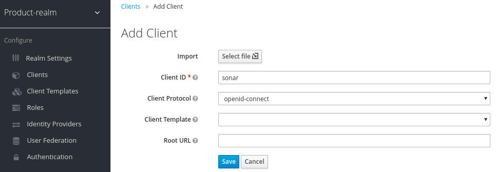

Navigate to "[Choose you realm] -> Clients -> sonar", activate the `Settings` tab,
fill the HTTPS url of SonarQube to the `Valid Redirect URIs`.

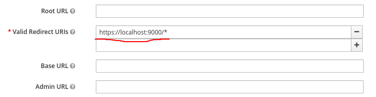

**NOTE**: Only HTTPS url is allowed for enabling SonarQube OAuth authentication.

#### 4. Get keycloak.json
Activate the `Installation` tab, and choose `Keycloak OIDC JSON` option.
Copy or download the json configuration.

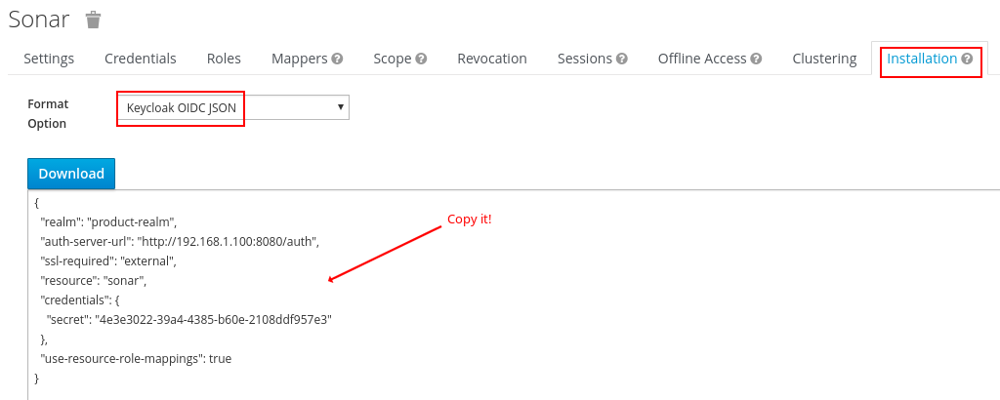

### Configuration
Login to your SonarQube with Administrator account,
and navigate to "Administration -> Configuration -> General Settings",
activate `Keycloak Auth` tab.

Allow new users to authenticate and enable Keycloak users to login.

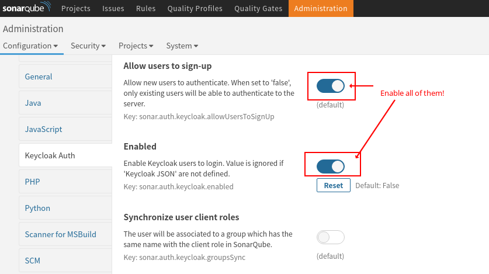

Paste the content of keycloak.json to `Keycloak JSON`.

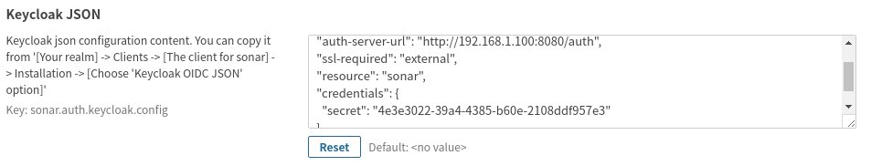

Now, you can log in with Keycloak in a new session.

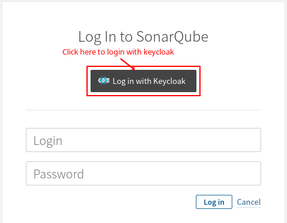

## Advanced

### Synchronize User Client Roles
You can create some Keycloak client roles and synchronize them with the group
in SonarQube which has the same name.

#### 1. Create token mapper
Login to your keycloak, and navigate to
"[Choose your realm] -> Clients -> sonar", activate the `Mappers` tab.
Click `Create` button to create a mapper whose `Token Claim Name` is `roles`.

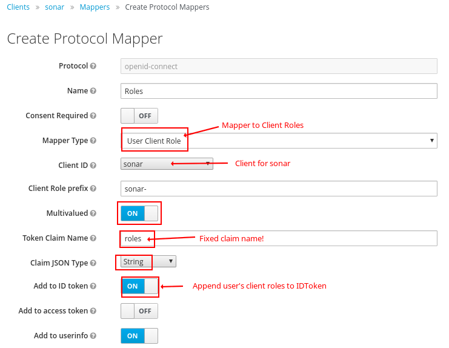

**NOTE**: The `Client Role prefix` is optional, it will be added to the `roles` automatically,
e.g. If a client role is named as `admin`, then `sonar-admin` will be synchronized with
the group which is named as `sonar-admin` also.

#### 2. Add client roles
Activate the `Roles` tab in the same client, and create some roles which will be used as sonar groups.


#### 3. Assign client roles to user
Navigate to "[Choose your realm] -> Users", choose one user (e.g. lily),
and activate `Role Mappings` tab, choose `sonar` for `Client Roles`.

Assign some roles to `lily`.

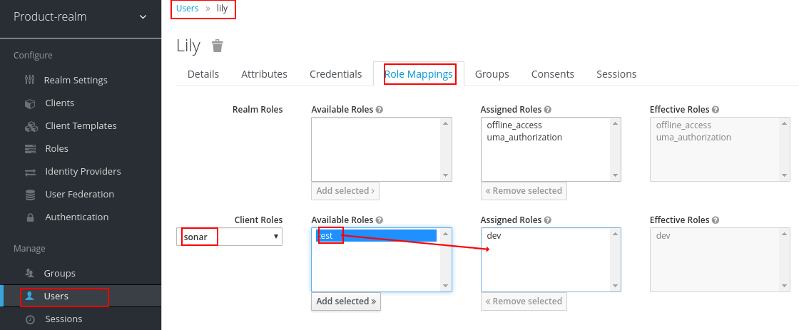

#### 4. Create sonar groups
Login to your SonarQube with Administrator account,
and navigate to "Administration -> Security -> Groups",
click `Create Group` button to add new group.

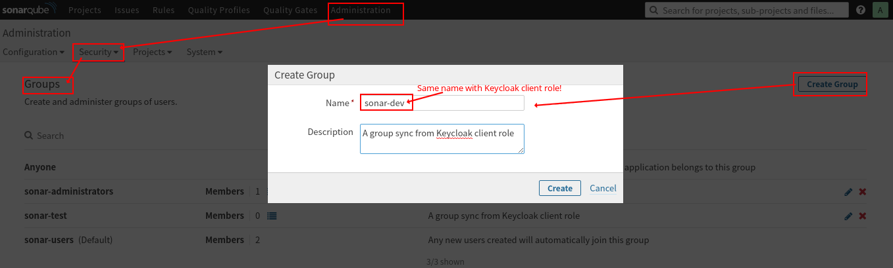

**NOTE**: The group name should be same with the Keycloak client roles of user.
If the `Client Role prefix` is specified in Keycloak, the sonar group name should contains
the prefix also.

#### 5. Enable client role synchronization
Navigate to "Administration -> Configuration -> General Settings -> Keycloak Auth",
enable `Synchronize user client roles`.

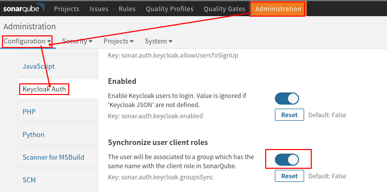

Login to SonarQube with Keycloak using account `lily` in a new session, go to account profile,
you will see `sonar-dev` and `sonar-test` are assigned to `lily`.

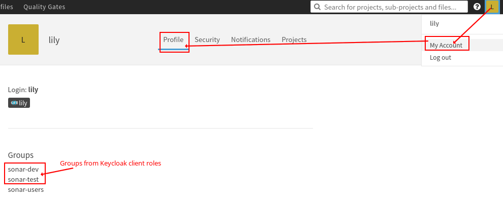

## Todos
* Add unit tests

## Contributing
[](https://github.com/flytreeleft/sonar-auth-keycloak-plugin/graphs/contributors)

Thanks to all contributors who helped to get this up and running.

## Thanks
* [GitHub Authentication for SonarQube](https://github.com/SonarSource/sonar-auth-github)
* [Keycloak Plugin for Jenkins](https://github.com/jenkinsci/keycloak-plugin)
